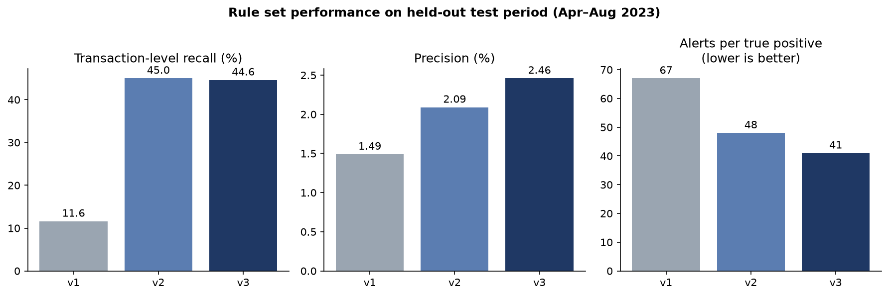
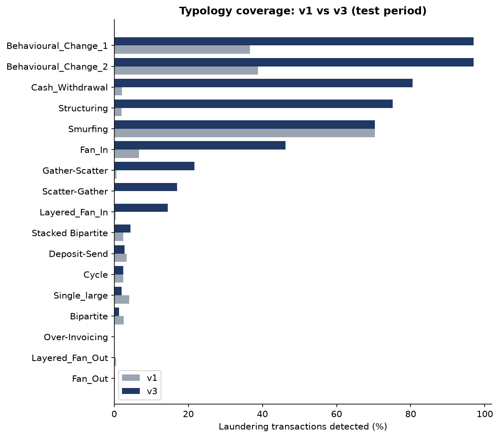
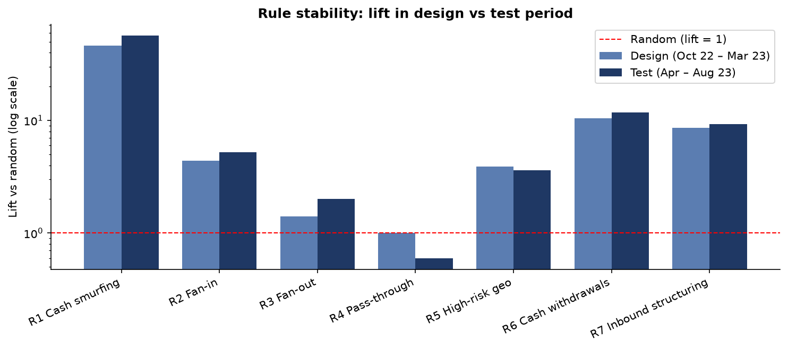
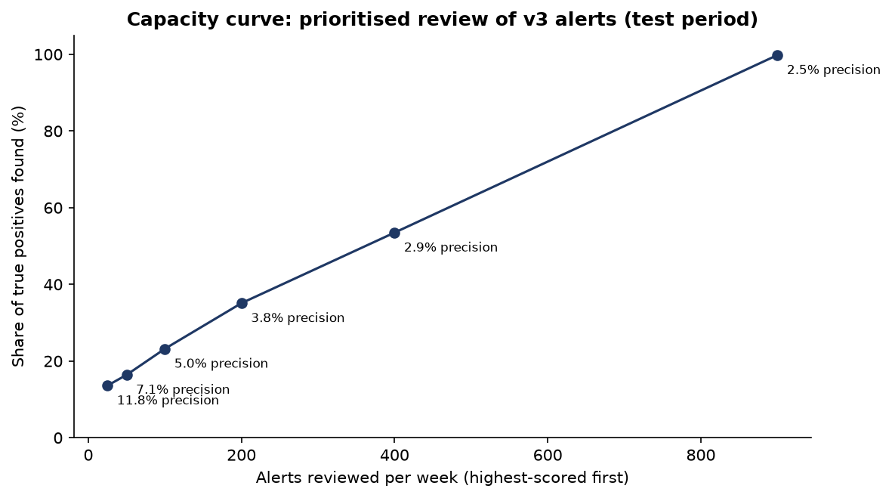

# Rule-Based Transaction Monitoring on Synthetic AML Data

Designing, evaluating and tuning anti-money laundering (AML) monitoring rules on 9.5 million synthetic transactions, with held-out validation, alert prioritisation and a blind case investigation.

**Author:** Oluwafemi Olagunju · Financial crime investigator (AML/KYC, fraud) · [LinkedIn](https://www.linkedin.com/in/oluwafemiolagunju3)

---

## Summary

I built a SQL-based transaction monitoring system, measured how well each rule detected 17 laundering typologies, diagnosed why most rules underperformed, and redesigned the rule set. On a held-out test period, the final rule set (**v3**) detected **3.8× more laundering transactions** than the initial set (**v1**), with **65% higher precision** and **39% less investigator effort per true positive**, using fewer rules.



| System (test period, Apr–Aug 2023) | Rules | Alerts/week | Precision | Lift vs random | Tx-level recall | Alerts per true positive |
|---|---|---|---|---|---|---|
| v1 (initial) | R1–R5 | 462 | 1.49% | 6.5× | 11.6% | 67 |
| v2 (redesigned) | R1–R3, R5–R7 | 1,035 | 2.09% | 9.1× | 45.0% | 48 |
| **v3 (final)** | **R1, R5, R6, R7** | **847** | **2.46%** | **10.7×** | **44.6%** | **41** |

---

## Dataset

[SAML-D](https://www.kaggle.com/datasets/berkanoztas/synthetic-transaction-monitoring-dataset-aml) (Oztas et al., 2023): 9,504,852 synthetic transactions (Oct 2022 – Aug 2023) with 28 labelled typologies (17 suspicious, 11 normal). Only 0.10% of transactions are suspicious, mirroring the extreme class imbalance of real monitoring.

---

## Approach

**Principles applied throughout**

1. **No label leakage.** Rules never use `Is_laundering` or `Laundering_type`. Labels are used only to evaluate.
2. **Data-driven thresholds.** Every threshold comes from unlabelled percentiles of normal behaviour or a regulatory anchor (10,000 reporting threshold, FATF list), and is documented in the SQL file.
3. **Held-out validation.** Rules were designed on Oct 2022 – Mar 2023 and judged on Apr – Aug 2023.
4. **Conceptual soundness.** A rule must make sense in practice, not just score well on synthetic data.

**Pipeline:** exploration → five initial rules → evaluation against labels → diagnosis of low recall → typology profiling → redesign (two new rules) → rule rationalisation → alert prioritisation → blind case investigation.

---

## Final rule set (v3)

| Rule | Logic (per account, per calendar week) | Threshold basis | Test lift |
|---|---|---|---|
| **R1 Cash smurfing** | ≥3 cash deposits, total ≥9,000, each <10,000 | p99 of weekly deposit counts; 10,000 reporting threshold | 56.5× |
| **R5 High-risk geography** | ≥200,000 to/from FATF-listed jurisdictions, **date-aware** | Between p90 and p99 of weekly exposure; FATF lists Oct 2022 – Feb 2023 | 3.6× |
| **R6 Cash withdrawals** | ≥4 cash withdrawals | First value above p90 of weekly withdrawal counts | 11.8× |
| **R7 Inbound structuring** | ≥4 distinct non-cash senders, total ≥10,000, median payment <10,000 | First value above p99 (3) of weekly distinct senders | 9.3× |

**Retired after evaluation:** R2 Fan-in (≥10 senders) and R3 Fan-out (≥17 receivers), whose coverage was largely absorbed by R7, and **R4 Pass-through** (≥45 payments forwarded within 48h at ±20% value), which showed a lift of 1.0 (no better than random) in the design period.

R5 uses a **date-aware** FATF list: Pakistan was delisted on 21 Oct 2022, Morocco on 24 Feb 2023, and Nigeria was added on 24 Feb 2023. Transaction counts per country were validated against each listing period.

---

## Key findings

### 1. Rules rarely caught what they were named for
A rule-to-typology matrix showed the original "structuring" rule caught **65% of smurfing but under 2% of structuring**. Profiling revealed why: in SAML-D, structuring uses **no cash**. It is many different senders each making one sub-threshold payment into the same account, visible only on the **receiving** side. Unexpectedly, the fan-in rule was the main detector of *behavioural change* typologies.

### 2. Low recall was structural, not just a threshold problem
68% of suspicious accounts appear in only **one** laundering transaction, so volume rules set at the 99th percentile cannot fire on them. Laundering receivers typically had **4–8 senders per week**, while the original threshold was 10. Transaction-level recall (did investigators *see* the activity?) proved a fairer metric than account-level recall.

### 3. Redesign targeted the gaps


v3 raised coverage of Behavioural Change 1 and 2 (36.6% / 38.8% → **97.0%**), Cash Withdrawal (2.1% → **80.5%**), Structuring (2.0% → **75.1%**) and Fan-In (6.7% → **46.2%**), and added new coverage of Gather-Scatter (21.6%), Scatter-Gather (17.0%) and Layered Fan-In (14.5%). Smurfing was unchanged at 70.3% (R1 is in both versions). Retiring R2–R4 cost small amounts of coverage on Single Large (4.0% → 2.0%), Bipartite (2.6% → 1.3%), Deposit-Send (3.4% → 2.8%) and Layered Fan-Out (0.5% → 0.0%). **Outbound dispersal (Fan-Out, Layered Fan-Out) and Over-Invoicing remain undetected.**

<details>
<summary>Full typology coverage table (test period)</summary>

| Typology | v1 | v3 | Change (pp) |
|---|---|---|---|
| Behavioural Change 1 | 36.6% | 97.0% | +60.4 |
| Behavioural Change 2 | 38.8% | 97.0% | +58.2 |
| Cash Withdrawal | 2.1% | 80.5% | +78.4 |
| Structuring | 2.0% | 75.1% | +73.1 |
| Smurfing | 70.3% | 70.3% | 0.0 |
| Fan-In | 6.7% | 46.2% | +39.5 |
| Gather-Scatter | 0.6% | 21.6% | +21.0 |
| Scatter-Gather | 0.0% | 17.0% | +17.0 |
| Layered Fan-In | 0.4% | 14.5% | +14.1 |
| Stacked Bipartite | 2.5% | 4.4% | +1.9 |
| Deposit-Send | 3.4% | 2.8% | −0.6 |
| Cycle | 2.5% | 2.5% | 0.0 |
| Single Large | 4.0% | 2.0% | −2.0 |
| Bipartite | 2.6% | 1.3% | −1.3 |
| Layered Fan-Out | 0.5% | 0.0% | −0.5 |
| Fan-Out | 0.0% | 0.0% | 0.0 |
| Over-Invoicing | 0.0% | 0.0% | 0.0 |

</details>

### 4. The rules generalise


Every rule performed consistently across design and test periods (e.g. R7 lift 8.6× → 9.3×). Typology profiling was repeated on design-period labels only and produced the same patterns (Structuring median of 4 senders), so the redesign does not depend on test-period data.

### 5. Rationalisation: fewer rules, better results
Removing R2 and R3 cut design-period volume from 1,104 to 899 alerts/week (−19%) for a 0.6 percentage-point recall loss, within a tolerance set in advance. Results held on the test period.

### 6. Prioritisation makes the queue workable


Alerts were scored using each rule's design-period lift (mirroring how banks weight rules by historical SAR conversion). The top 25 alerts per week reach **11.8% precision**, about 5× the queue average. **A team reviewing 200 alerts/week would find ~35% of true positives (≈26 alerts per real case); 400/week finds ~54%.**

Rule overlap was *not* a useful risk signal: multi-rule alerts showed no higher precision, because v3's rules target complementary typologies.

---

## Case study: blind investigation

I selected the top-ranked alert **without viewing its label**, investigated it, and recorded a disposition before checking the outcome. [Full SAR-style narrative →](reports/case_narrative.md)

- **Alert:** R1 + R7. ≈1.56M received in one week (~250× the account's norm) from 14 counterparties that paid no other account, each making exactly 12 payments.
- **Disposition:** escalate for SAR consideration.
- **Outcome:** **false positive.** The activity was labelled *Normal_Fan_In*.
- **Lesson:** dedicated counterparties and uniform payment counts are genuine mule indicators in practice, but the simulator generates *legitimate* fan-in with the same structure. A follow-up check showed every normal fan-in sender has exactly 12 lifetime transactions versus ~135 for laundering senders. That feature separates the groups almost perfectly, but it **was not adopted**, because it reflects the simulator's scheduling rather than real laundering behaviour.

---

## Limitations

- **Synthetic data.** SAML-D has generator artifacts (normal cash deposits never exceed ~6,000; normal fan-in senders have fixed schedules). Thresholds were set to avoid exploiting them.
- **No customer segmentation.** There is no business/personal flag, so R7 likely alerts on legitimate businesses. Real deployment would segment by customer type.
- **Calendar weeks.** Activity split across a week boundary is missed; production systems use rolling windows.
- **Within-rule ranking.** Alerts with equal scores (e.g. all R7-only alerts) are ordered arbitrarily; scoring within rules would improve the middle of the queue.
- **Label-informed design.** The redesign drew on typology profiling; this was mitigated by held-out validation and a design-period robustness check.

## Next steps

- An **outbound dispersal rule** mirroring R7 to cover Fan-Out typologies
- **Within-rule scoring** (e.g. by number of senders or value) for finer prioritisation
- **Rolling 7-day windows** instead of calendar weeks
- **Network analysis** to detect multi-hop schemes (cycles, bipartite structures) that weekly rules miss
- A **machine-learning benchmark** compared against the rules

---

## Repository structure

```text
├── sql/                         # One file per rule; thresholds documented in comments
│   ├── r1_cash_smurfing.sql
│   ├── r2_fan_in.sql            # retired
│   ├── r3_fan_out.sql           # retired
│   ├── r4_pass_through.sql      # retired
│   ├── r5_high_risk_geo.sql
│   ├── r6_cash_withdrawals.sql
│   └── r7_inbound_structuring.sql
├── notebooks/
│   ├── 01_exploration.ipynb     # Data loading, exploration, threshold research
│   ├── 02_rules.ipynb           # Rule execution
│   ├── 03_evaluation.ipynb      # Precision, recall, diagnostics, redesign, prioritisation
│   ├── 04_case_study.ipynb      # Blind investigation
│   └── 05_charts.ipynb          # Figures
├── reports/                     # Charts and case narrative
└── requirements.txt
```

## How to run

1. Clone the repo and create an environment:

```bash
   python -m venv .venv
   .venv\Scripts\activate        # Windows (macOS/Linux: source .venv/bin/activate)
   pip install -r requirements.txt
```

2. Download SAML-D from Kaggle and save it as `data/SAML-D.csv`.
3. Run the notebooks in order (01 → 05). Notebook 01 builds the `tx` table in `aml.duckdb`; notebook 02 runs the rules (R4 is the slowest, at a few minutes).

Built with Python, DuckDB (SQL), pandas and matplotlib.

## Citation

B. Oztas, D. Cetinkaya, F. Adedoyin, M. Budka, H. Dogan and G. Aksu, "Enhancing Anti-Money Laundering: Development of a Synthetic Transaction Monitoring Dataset," *2023 IEEE International Conference on e-Business Engineering (ICEBE)*, Sydney, Australia, 2023, pp. 47-54, doi: [10.1109/ICEBE59045.2023.00028](https://doi.org/10.1109/ICEBE59045.2023.00028).
